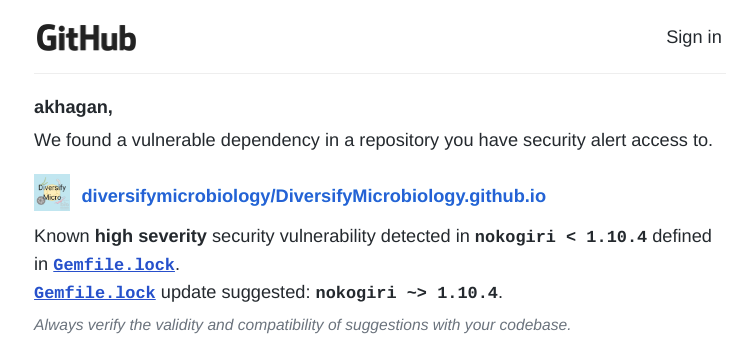
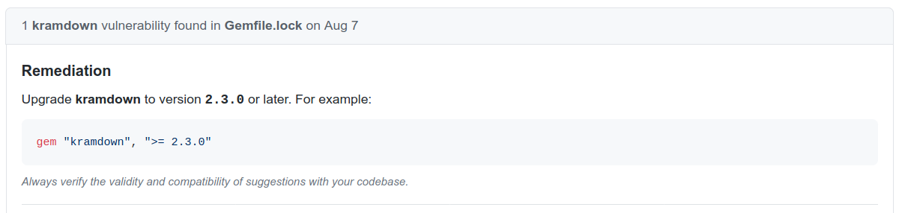
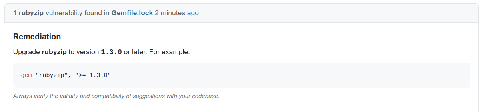

# DiversifyMicrobiology.github.io 
A resource for symposium organizers, award committees, search committees, etc. to identify microbiologists who might diversify their pool.


Below are instructions to make your own DiversifyScience website:

Pre-requisites:
  + Git & GitHub:
      + To learn what Git is and how it interacts with Github: http://swcarpentry.github.io/git-novice/ 
      + Instructions to install Git: https://carpentries.github.io/workshop-template/#git
      + Install GitHub Desktop: https://desktop.github.com/
  + Text editor (nano, Atom, RStudio, etc.)
      + See Git install instructions

1. Copy your template
    + Create/login to your GitHub account
    + Create an organization entitled "DiversifyYourScience" (Replace "YourScience" with your field of choice)
    + From the DiversifyMicrobiology repo page (i.e., this one), click "Use this template"
    + Direct a copy to your new organization
    + Rename the repository "DiversifyYourScience.github.io"
    + Clone the repository to your computer by clicking "Clone or Download"
        + Download a zip file or do it from commandline (`git clone https://...`)
2. Make it your own
    + Change the field (e.g., Immunology, Immuno) as needed in: 
        + `index.html` 
        + `nominate.md`
        + `_includes/header.html`
        + `_includes/footer.html` (line 12)
        + `list.md` (lines 4, 13)
    + Change contact information (e.g., email, url, twitter, github) in `_config.yml`
    + Change page creation/maintainence information (`_includes/footer.html`, lines 7,8) (Leave the "Make your own Diversify" link as is, so others can find these instructions)
    + Change the logo image by saving your own in `assets/img/` as "avatar.png"
    + Change the colors using hexidecimal values in `assets/css/main.scss` (lines 16 -18)
    + Change the yellow background bubble (on the homepage) by re-saving the image in your preferred color (as `assets/img/background.png`)
3. Change Google Forms and Spreadsheets
    + **Form:** Once you have your own form created: 
        + Click: 
          1. "Send" 
          2.  "<>"
          3.  copy the "iframe"
        + Replace `nominate.md`, line 20 with your form "iframe"
        + Replace the link in line 17 with the `https://` web link
    + **Spreadsheet:** From your own "public" spreadsheet: 
        + Click: 
          1. "File" 
          1. "Publish to the web" 
          1. "Embed" 
          1. copy the "iframe"
        + Replace the "iframe" in `list.md`, line 16
        + Replace the link in line 13 with the `https://` web link 
4. Make the changes public
    + Push the changes to your repository to make your website immediately available
        + **GitHub Desktop**: 
          1. Type "personalize diversify" in the "Summary" box
          2. Click "Commit"
          3. Click the black button (at the top) to "Push to origin"
        + **Git Commandline**: 
        Move to your git directory then execute the commands below:
        ```r
        git add .
        git commit -m "personalize diversify"
        git push
        ```
    + Repeat each time you make changes using a commit message (`commit -m`) that describes the changes you made.
    
# Fixing Tips 

If you are using our template and receive any of the messages shown below, follow the accompanying instructions:



1. Open `Gemfile.lock`
2. Change line 208 from `nokogiri (1.10.3)` to `nokogiri (~> 1.10.4)`
3. Push the changes to your repo



1. Open `Gemfile.lock`
2. Change line 194 from `kramdown (1.17.0)` to `kramdown (>= 2.3.0)`
3. Push the changes to your repo



1. Open `Gemfile.lock`
2. Change line 222 from `rubyzip (1.2.3)` to `rubyzip (>= 1.3.0)`
3. Push the changes to your repo


1. Open `Gemfile.lock`
2. Change line 9 from `addressable (2.6.0)` to `addressable (>=2.8.0)`
3. Push the changes to your repo


# Suggestions to improve the instructions?

Use the "Issues" tab at the top of this page (just under the repository name) to let me know!
